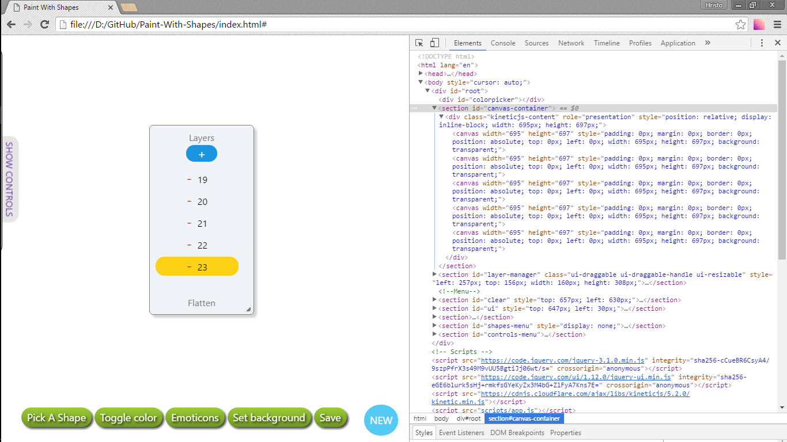
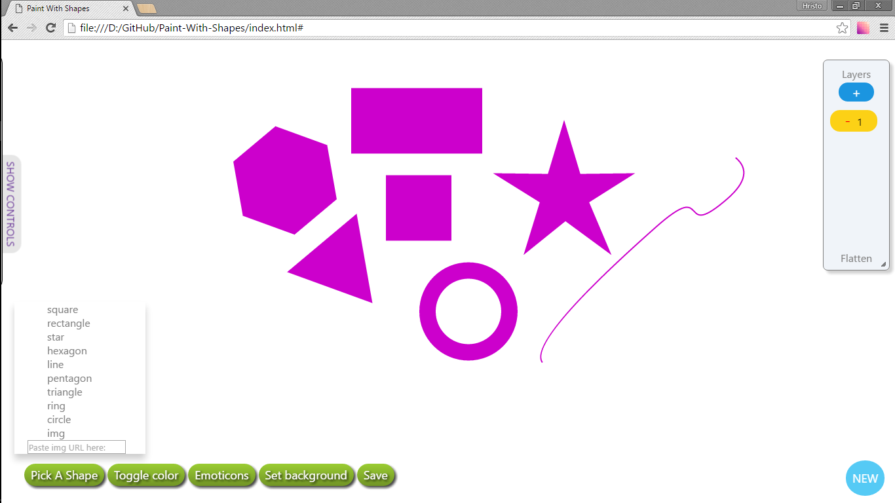

<!-- section start -->
<!-- attr: { class:'slide-title', showInPresentation:true, hasScriptWrapper:true } -->
# Team GodFather

<!--  -->

	
JS UI&DOM TeamWork

	
Telerik Academy by Progress

	<a href="https://github.com/TeamGodfather" class="signature-link">Link to the GitHub repository </a>

<!-- section start -->
<!-- attr: { showInPresentation:true, style:'font-size: 0.7em', hasScriptWrapper:true } -->

# Team Godfather Members

| Name | TALS | GitHub |
| :------------- | :------------------- | :------------------------------------------|
| Антонио Димитров  | Antonio.Dimitrov       | [AntonioDimitrov7 ](https://github.com/AntonioDimitrov7)                   |
| Ивайло Андонов   | ivail0 | [ivailoAndonov](https://github.com/ivailoAndonov)       |
| Мартин Йотов    | martinyotov  | [MartinYotov](https://github.com/MartinYotov)         |
| Миглена Петрова | Miglena_Petrova  | [MiglenaPetrova](https://github.com/MiglenaPetrova)         |
| Силвия Ботева | sboteva1    | [silweto7](https://github.com/silweto7)                 |
| Тодор Георгиев | Toshe7o    | [georgievtodor](https://github.com/georgievtodor)               |
| Христо Тодоров | todorovh      | [shakuu](https://github.com/shakuu) |

<!-- section start -->
<!-- attr: { showInPresentation:true, style:'font-size: 0.7em', hasScriptWrapper:true } -->

# GitHub graphics

<!--  -->

<!--  -->

<!-- section start -->
<!-- attr: { showInPresentation:true, style:'font-size: 0.7em', hasScriptWrapper:true } -->

# Layer Manager Screenshot

<!--  -->

<!--  -->

<!-- section start -->
<!-- attr: { showInPresentation:true, style:'font-size: 0.7em', hasScriptWrapper:true } -->

# Layer Manager Features

- **Add** new layer on top

- **Remove** any layer

- **Flatten** all layers - save as a single image

- **Insert** background layer from url

<!-- section start -->
<!-- attr: { showInPresentation:true, style:'font-size: 0.7em', hasScriptWrapper:true } -->

# Shapes Screenshot

<!--  -->

<!--  -->

<!-- section start -->
<!-- attr: {  showInPresentation:true, style:'font-size: 0.7em', hasScriptWrapper:true } -->

# Shapes Features

- **Move**

- **Rotate**

- **Scale**

- **Alpha**
